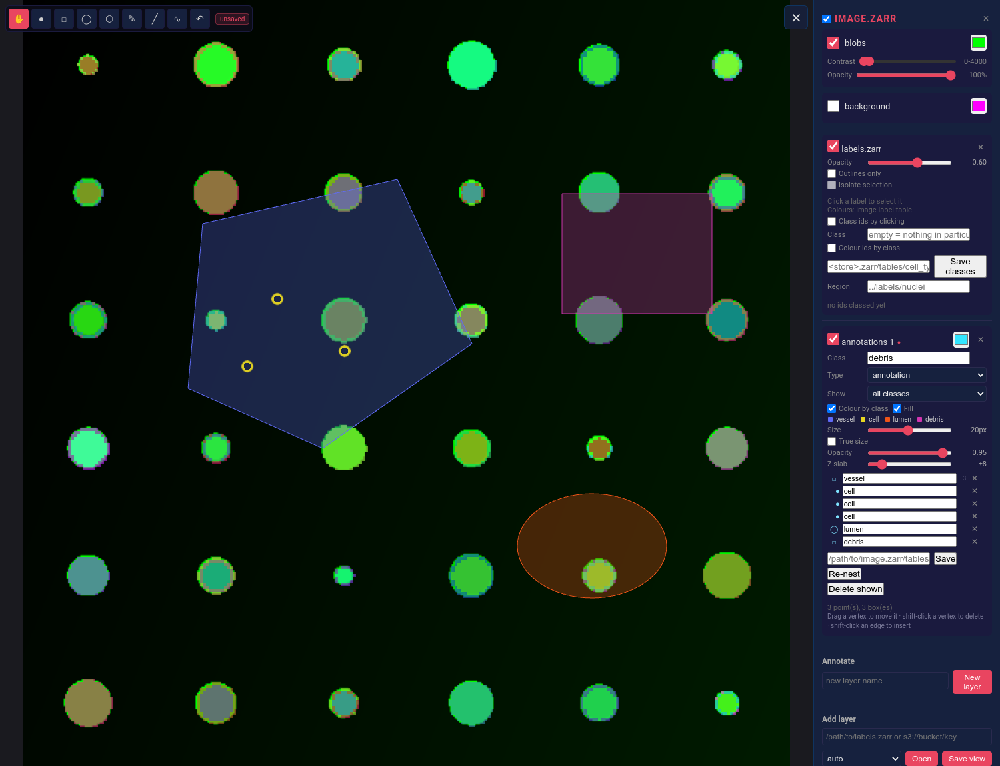

# omezarr-viewer-rs

**Experimental / WIP**

A viewer for what an imaging pipeline actually produces: the image, the label
volumes, the masks, and the tables of detected objects — over the same
coordinates, from disk or from object storage, in a browser or as a desktop app.

Built for the output of [`clearmap-ng`](https://github.com/henriksson-lab) and
[`blockflow`](https://github.com/henriksson-lab/blockflow) (cellpose, stardist
and YOLO detections among them), but it imposes no format of its own: it reads
what those pipelines already write. `PLAN.md` records the design and what is
built.



*An image layer with a label volume over it, and hand-drawn annotations in four
classes — a polygon, three points, an ellipse and a rectangle — with the class
carrying the colour. The demo store is synthetic, so every value in it is known
by arithmetic.*

`make screenshot` regenerates this from `tools/screenshot.py`, which builds the
demo store, drives a real browser and draws the scene. It is a script rather
than a picture somebody once took, because a screenshot that has drifted from
the software is worse than none.

### Slice grid

A 2x2 layout: the `xy` view with the drawing tools on it, the two orthogonal
slices, and a box drawn to the volume's true proportions showing where those
three cuts sit. Dragging a plane in the box scrubs that axis.

The box is deliberately not normalised to a cube — a 512x512x8 volume is a slab,
and it should look like one. The camera is fixed and near-isometric rather than
isometric: at true isometric all three axes project to the same length and the
box reads as a hexagon with no way to tell `x` from `z`.

## What it shows

| Layer kind | Read from |
|---|---|
| **Image** | OME-Zarr multiscale stores; a flat `.npy` volume is an image with one level |
| **Labels** | integer id volumes (cellpose/stardist instances, atlas regions), drawn from the array's own dtype so ids above 2²⁴ stay distinct |
| **Objects** | one row per detection: YOLO CSV, `blockflow` table blobs, `.npy` point arrays (plain or structured) |

Layers stack in one world: a half-resolution label volume lands on the image it
describes, and a detector's coordinates can be scaled into place per layer.

## Features

- Multi-layer session: add and close layers at runtime, or open a whole run
  directory in one go
- Per-channel colour, contrast and opacity; stacked image layers composite
  additively, and a layer that declares no display window takes its contrast
  from the first tile it loads
- Label rendering with hashed or `image-label` colours, outline mode,
  isolate-selection, and click-to-identify
- Object overlays with screen-sized points, colour-by-column, per-column filters
  that apply without a round trip, z-slab fading, and click-to-inspect
- Orthogonal XZ/YZ panes with a crosshair linked across all three views
- Server-side maximum and mean projection through a z slab
- Atlas region names for label ids, and a per-region object tally
- Pyramid level chosen per layer from the zoom; tiled loading with coarse-level
  fallback; a bounded tile cache on the server
- Local filesystem, HTTP and S3 (named profiles) as peers

## Prerequisites

- Rust toolchain (stable)
- `trunk` for the WASM frontend: `cargo install trunk`
- WASM target: `rustup target add wasm32-unknown-unknown`
- For the desktop build on Linux: `webkit2gtk-4.1` and `libsoup-3.0` development
  packages

## Quick start

```bash
make demo                        # writes a synthetic image + labels + cells
make run PROJECT=/tmp/omezarr-demo
```

Then open http://127.0.0.1:8078.

Open a real run directory the same way — every zarr store, `.npy` volume and
object table under it becomes a layer:

```bash
make run PROJECT=/path/to/clearmap-run
```

Or a single store:

```bash
make serve STORE=/path/to/dataset.zarr
make serve STORE=s3://bucket/prefix/dataset.zarr
```

## Desktop

```bash
make desktop          # a runnable binary
./target/release/omezarr-viewer-desktop --project /path/to/run
```

The desktop app starts the same server in-process on a port the OS picks, serves
the frontend from inside the binary, and adds native file dialogs — which go
back through the same HTTP API the browser uses. `make desktop-bundle` produces
installers and needs `cargo install tauri-cli`.

## Converting `.npy` for object storage

A `.npy` has no chunk grid and no pyramid: fine on local disk, poor over S3.

```bash
cargo run --release --bin omezarr_convert -- mask.npy mask.zarr
```

Levels are mean-reduced for intensity data and nearest-sampled for labels,
because averaging two ids invents a third.

## Build commands

```bash
make build            # frontend + server, release
make run PROJECT=…    # open a run directory or project file
make serve STORE=…    # open one store (S3 flags apply)
make desktop          # desktop binary
make demo             # synthetic dataset
make test             # server tests + clippy on both crates
make dev-app          # watch-rebuild the frontend
make dev-server       # watch-rebuild the server
```

## Continuous integration

| Workflow | When | What |
|---|---|---|
| `ci.yml` | push to `main`, PRs, manual | server tests, `clippy -D warnings` on server and frontend, `cargo fmt --check`, and a desktop build — on Linux, macOS and Windows |
| `release.yml` | a `v*` tag, or manual | desktop bundles for all three platforms; a tag attaches them to a **draft** release, a manual run just keeps them as artifacts |

Both build the WASM frontend first: the desktop binary compiles it in, so a
missing `dist/` is a build failure rather than a run-time surprise.

`desktop/gen/schemas/` is not committed — Tauri regenerates it on every build
and writes a different set per platform.

## Architecture

A Cargo workspace of four crates:

| Crate | Path | What it is |
|-------|------|------------|
| `omezarr-viewer-common` | `src/` | the API contract: session, layers, schemas |
| `server` | `server/` | actix-web API, readers, project scanning, converter |
| `app` | `app/` | Yew + WebGL2 frontend |
| `omezarr-viewer-desktop` | `desktop/` | Tauri shell around both |

### API

| Endpoint | Answers |
|---|---|
| `GET /api/session` | every open layer, in draw order |
| `GET /api/tile` | a tile; `encoding=f32\|raw`, `zproj=max\|mean&depth=` |
| `GET /api/slice` | a whole plane across `axis=z\|y\|x` |
| `GET /api/value` | one voxel — the id under a click, with its region name |
| `GET /api/objects` | rows in a region, packed binary, with `X-Total` |
| `GET /api/objects/at` | the row nearest a point, exact values |
| `GET /api/regions` | objects per region, joined through a label volume |
| `GET`/`POST /api/project` | the session as a project file, and back |
| `POST`/`DELETE /api/layers` | add a layer (or scan a run folder), close one |
| `GET /api/stats` | cache occupancy |

`GET /api/info` and `POST /api/open` remain for the single-dataset S3 flow the
viewer started with.

Annotations add:

| Endpoint | Answers |
|---|---|
| `POST /api/annotations/layers` | start an empty annotation layer |
| `GET`/`POST /api/annotations/{layer}` | the shapes; add one (nested by containment) |
| `PUT`/`DELETE /api/annotations/{layer}/{id}` | edit one; delete one, keeping what was inside it |
| `POST /api/annotations/{layer}/{id}/detach` | lift one out of its parent |
| `POST /api/annotations/{layer}/renest` | rebuild the hierarchy from where shapes now are |
| `POST /api/annotations/{layer}/save` | write to disk — GeoJSON or an ROI table, by target shape |
| `GET /api/annotations/tables` | the annotation sets and ROI tables a store holds |

## Known gaps

Recorded so they can be picked up rather than rediscovered. `PLAN.md` has the
reasoning behind each; `info_roi.md` and `info_annotation_formats.md` have the
format research. **`QUALITY.md` tracks the separate question of how trustworthy
the code that exists is** — test coverage, file sizes, error handling — rather
than what it cannot yet do.

### Annotation formats

- **No OME-XML export.** A mechanical downgrade from the GeoJSON we write
  (polygonise ellipses, flatten the hierarchy, move measurements to a
  `MapAnnotation`) — but holes have no representation in OME-XML at all, so it
  is lossy by the format's own limits, not ours.
- **No raster brush.** A painted annotation belongs in a `labels` image, which
  *is* in the OME-Zarr spec and which this viewer already reads — but nothing
  writes one yet. This is also where a rasterised polygon would land.

### Tables

- **A `condition_table` is shown but not used.** It is experiment-level
  metadata; nothing yet reads it into the session's own description of the
  dataset.
- **A `masking_roi_table` opens as boxes and keeps its `region` link, but does
  not use it.** Its rows could paint the label image the way a feature table's
  do; only the feature-table path is wired.
- **A table cannot be sorted or filtered** in the view, and a picked label id
  does not scroll its row into view.
- **`obsm` keys other than `spatial` are ignored** — a UMAP or a PCA embedding
  under `obsm` is not a position and is not offered as one.
- **A remote AnnData table is not read at all.** CSV, JSON and Parquet come back
  from an `s3://` or `http(s)://` store because each is one payload key to
  fetch; AnnData is a group of arrays, and the reader that walks them is the
  synchronous one. `read_async` says so rather than failing obscurely.

### Annotation for training

- **A stroke's width is stored, not its pixels.** A `LineString` with a
  `strokeWidth` is a scribble covering the pixels within half that width of the
  path; one without is a geometric line covering none. Storing the path defers
  rasterisation to whoever trains, at the level they train at — a mask
  rasterised at a downsampled level and scaled back up teaches a
  boundary-regressing model to reproduce the staircase.
- **`denseRegion` says where "unlabelled" means background.** Sparse is the
  default: a scribble asserts something about the pixels it covers and nothing
  about any other. Inside a shape marked dense, uncovered means background,
  because the curator has said they marked every instance in it. A trainer that
  reads sparse annotation as dense learns that every unmarked object is
  background, which is worse than no training data.
- **The rasterisation rule is declared in the group attributes**, so two
  rasterisers agree: round caps and joins, even-odd over the rings, 4x4
  subsamples per pixel at 7 of 16, level 0. Left unstated, "a stroke of width
  11" is an intention rather than a set of voxels.
- **Objects in a label image are classed by clicking them.** Set a class, click
  an instance, and it takes it; the label image is never modified. Three states
  are kept apart on purpose — an id nobody has looked at, an id looked at and
  found to be nothing in particular, and an id with a class — because collapsing
  the first two makes "I have not started" read as "none of these are cells".
  Colouring the ids by class is the feedback loop: it shows what is left without
  reading a list.
- **A class per label id is written as a feature table.** A segmented object has
  no geometry here — it is an id in a raster somebody else produced — so its
  class travels in a table joined by that id, which is what `region` and
  `instance_key` are for. This is the cheap half of annotation for training: the
  instances already exist, so it is a table write with no brush, no
  rasterisation and nothing to resample. An id with no row has not been looked
  at; an id with an empty class has been, and was nothing in particular.
- **Nothing writes a label image yet.** The rasteriser is a `blockflow` op; this
  side writes the geometry and the rules, as a `blockflow` table blob of one row
  per vertex.

### Annotation round trips

- **Colour alpha is dropped** (`[r,g,b,a]` → `[r,g,b]`): nothing draws a
  per-object alpha.
- **Non-finite measurements are dropped.** QuPath writes them as the *strings*
  `"NaN"`/`"Infinity"`; turning those into a number would be wrong differently.
- **`nucleusGeometry` is drawn but not editable** — a cell's nucleus outline
  shows, and survives the round trip, but the drag handles only ever address the
  main geometry.

### Saving

- **Nothing is written to disk until Save.** Every edit reaches the server
  immediately, so reloading the page is safe, but a server restart loses
  unsaved work with no warning — the browser's unload guard cannot fire for a
  process being killed. A crash-safe autosave beside the real file (recovered on
  open, deleted on save) would close this without making the viewer write to a
  dataset unasked.

### Other

- **`--allow-remote-writes` is all-or-nothing.** There is no per-store or
  per-bucket grant.
- **Vessel graphs** remain blocked upstream: `clearmap-ng`'s `VesselGraph` has
  no canonical byte form (PLAN.md phase 7).
